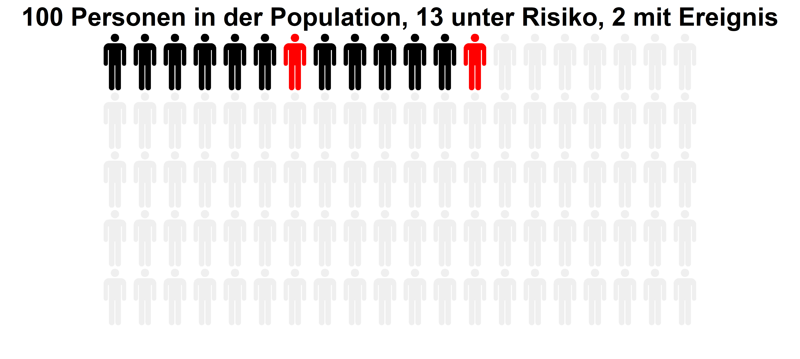

```{r meta, echo=FALSE, warning=FALSE}
library(metathis)
meta() %>%
  meta_general(
    description = "Test",
    generator = "xaringan and remark.js"
  ) %>% 
  meta_name("github-repo" = "andreasmeid") %>% 
  meta_social(
    title = "Test Titel",
    #url = "https://spcanelon.github.io/xaringan-basics-and-beyond/slides/day-01-basics.html#1",
    #image = "https://raw.githubusercontent.com/spcanelon/xaringan-basics-and-beyond/main/slides/day-01-cover-image.png",
    og_type = "website",
    og_author = "Andreas Meid"
  )
```

```{r setup, include=FALSE}
options(htmltools.dir.version = FALSE)

#library(devtools)
    #install_local('I:/Bereich/Neuausrichtung/GAM/icons-master')
    #install_local('I:/Bereich/Neuausrichtung/GAM/xaringanExtra-master')

library(icons)
library(xaringanExtra)
library(tidyverse)
library(mgcv)
library(ggplot2)
library(patchwork)
library(here)
library(emmeans)
library(gganimate)
library(lme4)
library(gamm4)

set.seed(1) #for reproducibility
knitr::opts_chunk$set(
  fig.asp = 9/16,
  fig.align = 'center',
  dpi= 600,
  #fig.width=9, 
  #fig.height=3.5, 
  #fig.retina=3,
  out.width = "80%",
  out.width = "89%", # wegen Haerdtlein
  cache = FALSE,
  echo = TRUE,
  message = FALSE, 
  warning = FALSE,
  fig.show = TRUE,
  fig.showtext = TRUE,
  hiline = TRUE
)

xaringanExtra::use_panelset()
xaringanExtra::use_tile_view()
xaringanExtra::use_share_again()
xaringanExtra::style_share_again(
  share_buttons = c("twitter","linkedin")
)

```

class: title-slide, right, top
background-image: url(img/ukhd_en.png)
background-position: 10% 75%, 75% 75%
background-size: 20%, cover

.right-column[
# `r rmarkdown::metadata$title`
### `r rmarkdown::metadata$subtitle`

**`r rmarkdown::metadata$author`**<br>
<br>
`r rmarkdown::metadata$institute` <br><br>
`r rmarkdown::metadata$date`
]


---
class: body-yellow
background-image: url(img/DrugSymposium_Background.PNG)

## Ausgangslage


```{r,echo=FALSE, eval=F, results='hide', message=F, warning=F }


```

<!--  -->

```{r icon-style, eval=F, echo=F, message=F, warning=F} 

```


---
# Wissenschaftliches Programm


.footnote[[1] _https://www.gaa-arzneiforschung.de/jahrestagungen/30-jahrestagung-2023, aufgerufen am 28.9.2023_ ] 

---

# Eine Reise für PatientInnen ... 

```{r,echo=FALSE, eval=F, results='hide', message=F, warning=F }
if(!require(tidyr)) {install.packages("tidyr"); library(tidyr, quietly = TRUE)}
if(!require(dplyr)) {install.packages("dplyr"); library(dplyr, quietly = TRUE)}
if(!require(tibble)) {install.packages("tibble"); library(tibble, quietly = TRUE)}
if(!require(rstudioapi)) {install.packages("rstudioapi"); library(rstudioapi, quietly = TRUE)}
if(!require(pacman)) {install.packages("pacman"); library(pacman, quietly = TRUE)}
if(!require(vistime)) {install.packages("vistime"); library(vistime, quietly = TRUE)}
if(!require(tidyfst)) {install.packages("tidyfst"); library(tidyfst, quietly = TRUE)}

getCurrentFileLocation <-  function()
{
  this_file <- commandArgs() %>%
    tibble::enframe(name = NULL) %>%
    tidyr::separate(col=value, into=c("key", "value"), sep="=", fill='right') %>%
    dplyr::filter(key == "--file") %>%
    dplyr::pull(value)
  if (length(this_file)==0)
  {
    this_file <- rstudioapi::getSourceEditorContext()$path
  }
  return(dirname(this_file))
}
hauptpfad <- paste0(getCurrentFileLocation(), "/")
setwd(hauptpfad)

```

```{r,echo=FALSE, eval=T, results='hide', message=F, warning=F }
# load plots

```
.panelset[
.panel[.panel-name[Auktoriale Sicht]


]

.panel[.panel-name[Forscher-Sicht]


]


]


---
class: body-yellow
background-image: url(img/background06.PNG)

## AusblicK & <br /> Diskussion 


