```{r meta, echo=FALSE, warning=FALSE}
library(metathis)
meta() %>%
  meta_general(
    description = "Test",
    generator = "xaringan and remark.js"
  ) %>% 
  meta_name("github-repo" = "andreasmeid") %>% 
  meta_social(
    title = "Test Titel",
    #url = "https://spcanelon.github.io/xaringan-basics-and-beyond/slides/day-01-basics.html#1",
    #image = "https://raw.githubusercontent.com/spcanelon/xaringan-basics-and-beyond/main/slides/day-01-cover-image.png",
    og_type = "website",
    og_author = "Andreas Meid"
  )
```

```{r setup, include=FALSE}
options(htmltools.dir.version = FALSE)

#library(devtools)
    #install_local('I:/Bereich/Neuausrichtung/GAM/icons-master')
    #install_local('I:/Bereich/Neuausrichtung/GAM/xaringanExtra-master')

library(icons)
library(xaringanExtra)
library(tidyverse)
library(mgcv)
library(ggplot2)
library(patchwork)
library(here)
library(emmeans)
library(gganimate)
library(lme4)
library(gamm4)

set.seed(1) #for reproducibility
knitr::opts_chunk$set(
  fig.asp = 9/16,
  fig.align = 'center',
  dpi= 600,
  #fig.width=9, 
  #fig.height=3.5, 
  #fig.retina=3,
  out.width = "80%",
  out.width = "89%", # wegen Haerdtlein
  cache = FALSE,
  echo = TRUE,
  message = FALSE, 
  warning = FALSE,
  fig.show = TRUE,
  fig.showtext = TRUE,
  hiline = TRUE
)

xaringanExtra::use_panelset()
xaringanExtra::use_tile_view()
xaringanExtra::use_share_again()
xaringanExtra::style_share_again(
  share_buttons = c("twitter","linkedin")
)

```

class: title-slide, right, top
background-image: url(img/ukhd_en.PNG)
background-position: 10% 75%, 75% 75%
background-size: 20%, cover

.right-column[
# `r rmarkdown::metadata$title`
### `r rmarkdown::metadata$subtitle`

**`r rmarkdown::metadata$author`**<br>
<br>
`r rmarkdown::metadata$institute` <br><br>
`r rmarkdown::metadata$date`
]


---
class: body-yellow
background-image: url(img/DrugSymposium_Background.png)

## Ausgangslage


```{r,echo=FALSE, eval=F, results='hide', message=F, warning=F }
library(personograph)

data_2 <- list(first=0.06, second=0.01, third=0.05, forth=0.01, fifth=0.87)


png(filename =  paste0("img/Population.png"),
    width = 20, height = 9, units = "cm", bg = "transparent", res = 600)
personograph(data_2, colors=list(first="black", second="red", third="black", forth="red",fifth="#efefef"),
    fig.title = "100 Personen in der Population, 13 unter Risiko, 2 mit Ereignis",
    draw.legend = FALSE,  dimensions=c(5,20))
dev.off()

```


```{r icon-style, eval=F, echo=F, message=F, warning=F} 
icon_style(fontawesome("book", style = "solid"), scale = 3.5, fill = "black")
```


---
# Wissenschaftliches Programm


.footnote[[1] _https://www.gaa-arzneiforschung.de/jahrestagungen/30-jahrestagung-2023, aufgerufen am 28.9.2023_ ] 

---

# Eine Reise für PatientInnen ... 

```{r,echo=FALSE, eval=F, results='hide', message=F, warning=F }
if(!require(tidyr)) {install.packages("tidyr"); library(tidyr, quietly = TRUE)}
if(!require(dplyr)) {install.packages("dplyr"); library(dplyr, quietly = TRUE)}
if(!require(tibble)) {install.packages("tibble"); library(tibble, quietly = TRUE)}
if(!require(rstudioapi)) {install.packages("rstudioapi"); library(rstudioapi, quietly = TRUE)}
if(!require(pacman)) {install.packages("pacman"); library(pacman, quietly = TRUE)}
if(!require(vistime)) {install.packages("vistime"); library(vistime, quietly = TRUE)}
if(!require(tidyfst)) {install.packages("tidyfst"); library(tidyfst, quietly = TRUE)}

getCurrentFileLocation <-  function()
{
  this_file <- commandArgs() %>%
    tibble::enframe(name = NULL) %>%
    tidyr::separate(col=value, into=c("key", "value"), sep="=", fill='right') %>%
    dplyr::filter(key == "--file") %>%
    dplyr::pull(value)
  if (length(this_file)==0)
  {
    this_file <- rstudioapi::getSourceEditorContext()$path
  }
  return(dirname(this_file))
}
hauptpfad <- paste0(getCurrentFileLocation(), "/")
setwd(hauptpfad)

# A -----------------------------------------------------------------------


# Patient 1: wenig Hosp., unvollst. Nachbeobachtungsdauer (z.B. Tod)
timeline_data1 <- data.frame(event=c("", "H", "", "H", "", ""), 
                            start = c("2020-01-01", "2020-04-07", "2020-04-10", "2020-04-27", "2020-05-02", "2020-10-01"), 
                            end = c("2020-04-07", "2020-04-10", "2020-04-27", "2020-05-02", "2020-10-01", "2020-12-31"), 
                            group = "Patient 1", 
                            color=c("lightgray", "lightgray", "lightgray", "lightgray", "lightgray", "white"),
                            #color=c("lightgray", "black", "lightgray", "black", "lightgray", "white"),
                            col.end = "black") 

# Patient 2: viele Hosp., vollst. Nachbeobachtungsdauer 

timeline_data2 <- data.frame(event=c("", "H", "", "H", "", "H","", "H", "", "H", "", "H",  ""), 
                             start = c("2020-01-01", "2020-02-10", "2020-02-25", "2020-03-26", "2020-04-01",
                                       "2020-04-28","2020-05-03", "2020-06-16", "2020-07-02", "2020-09-25", "2020-09-28", "2020-10-11", "2020-10-15"), 
                             end = c("2020-02-10", "2020-02-25", "2020-03-26", "2020-04-01",  "2020-04-28", 
                                     "2020-05-03", "2020-06-16", "2020-07-02", "2020-09-25", "2020-09-28", "2020-10-11", "2020-10-15", "2020-12-31"), 
                             group = "Patient 2", 
                             color=c(rep("lightgray",13)),
                             #color=c("lightgray", "black", "lightgray", "black", "lightgray",
                            #         "black", "lightgray", "black", "lightgray", "black", "lightgray", "black", "lightgray"),
                             col.end = "black") 

# Patient 3: viele Hosp., unvollst. Nachbeobachtungsdauer (z.B. Tod)

timeline_data3 <- data.frame(event=c("", "H", "", "H", "", "H","", "H", "", "H", "", "H",  ""), 
                             start = c("2020-01-01", "2020-01-15", "2020-01-31", "2020-03-01", "2020-03-11",
                                       "2020-04-08","2020-04-17", "2020-05-06", "2020-05-20", "2020-06-22", "2020-07-15", "2020-07-30", "2020-08-14"), 
                             end = c("2020-01-15", "2020-01-31", "2020-03-01", "2020-03-11",  "2020-04-08", 
                                     "2020-04-17", "2020-05-06", "2020-05-20", "2020-06-21", "2020-07-15", "2020-07-30", "2020-08-14", "2020-12-31"), 
                             group = "Patient 3", 
                             color=c(rep("lightgray",12), "white"),
                             #color=c("lightgray", "black", "lightgray", "black", "lightgray",
                            #          "black", "lightgray", "black", "lightgray", "black", "lightgray", "black", "white"),
                             col.end = "black") 

# Patient 4: wenig Hosp., vollst. Nachbeobachtungsdauer (z.B. Tod)
timeline_data4 <- data.frame(event=c("", "H", "", "H", "", "H", ""), 
                             start = c("2020-01-01", "2020-05-17", "2020-05-22", "2020-07-27", "2020-08-08", "2020-10-12","2020-10-22"), 
                             end = c("2020-05-17", "2020-05-22", "2020-07-27", "2020-08-08", "2020-10-12", "2020-10-22", "2020-12-31"), 
                             group = "Patient 4", 
                             color=c("lightgray", "lightgray", "lightgray", "lightgray", "lightgray", "lightgray","lightgray"),
                             #color=c("lightgray", "black", "lightgray", "black", "lightgray", "black", "lightgray"),
                             col.end = "black") 

timeline_data_all <- rbind(timeline_data1, timeline_data2, timeline_data3, timeline_data4)

#vistime(timeline_data) 
#vistime_data(timeline_data_all) 
Part_A <- gg_vistime(timeline_data_all, background_lines=2, linewidth=8)

# Part_A + ggplot2::ggtitle("Nachbeobachtungen in Routinedaten (inkl. Hospitalisierungen, H)")

# B -----------------------------------------------------------------------

# Patient 1: wenig Hosp., unvollst. Nachbeobachtungsdauer (z.B. Tod)
timeline_data1 <- data.frame(event=c("", "H", "", "H", "", ""), 
                             start = c("2020-01-01", "2020-04-07", "2020-04-10", "2020-04-27", "2020-05-02", "2020-10-01"), 
                             end = c("2020-04-07", "2020-04-10", "2020-04-27", "2020-05-02", "2020-10-01", "2020-12-31"), 
                             group = "Patient 1", 
                             #color=c("lightgray", "lightgray", "lightgray", "lightgray", "lightgray", "white"),
                             color=c("lightgray", "black", "lightgray", "black", "lightgray", "white"),
                             col.end = "black") 

# Patient 2: viele Hosp., vollst. Nachbeobachtungsdauer 

timeline_data2 <- data.frame(event=c("", "H", "", "H", "", "H","", "H", "", "H", "", "H",  ""), 
                             start = c("2020-01-01", "2020-02-10", "2020-02-25", "2020-03-26", "2020-04-01",
                                       "2020-04-28","2020-05-03", "2020-06-16", "2020-07-02", "2020-09-25", "2020-09-28", "2020-10-11", "2020-10-15"), 
                             end = c("2020-02-10", "2020-02-25", "2020-03-26", "2020-04-01",  "2020-04-28", 
                                     "2020-05-03", "2020-06-16", "2020-07-02", "2020-09-25", "2020-09-28", "2020-10-11", "2020-10-15", "2020-12-31"), 
                             group = "Patient 2", 
                             #color=c(rep("lightgray",13)),
                             color=c("lightgray", "black", "lightgray", "black", "lightgray",
                                      "black", "lightgray", "black", "lightgray", "black", "lightgray", "black", "lightgray"),
                             col.end = "black") 

# Patient 3: viele Hosp., unvollst. Nachbeobachtungsdauer (z.B. Tod)

timeline_data3 <- data.frame(event=c("", "H", "", "H", "", "H","", "H", "", "H", "", "H",  ""), 
                             start = c("2020-01-01", "2020-01-15", "2020-01-31", "2020-03-01", "2020-03-11",
                                       "2020-04-08","2020-04-17", "2020-05-06", "2020-05-20", "2020-06-22", "2020-07-15", "2020-07-30", "2020-08-14"), 
                             end = c("2020-01-15", "2020-01-31", "2020-03-01", "2020-03-11",  "2020-04-08", 
                                     "2020-04-17", "2020-05-06", "2020-05-20", "2020-06-21", "2020-07-15", "2020-07-30", "2020-08-14", "2020-12-31"), 
                             group = "Patient 3", 
                             #color=c(rep("lightgray",12), "white"),
                             color=c("lightgray", "black", "lightgray", "black", "lightgray",
                                       "black", "lightgray", "black", "lightgray", "black", "lightgray", "black", "white"),
                             col.end = "black") 

# Patient 4: wenig Hosp., vollst. Nachbeobachtungsdauer (z.B. Tod)
timeline_data4 <- data.frame(event=c("", "H", "", "H", "", "H", ""), 
                             start = c("2020-01-01", "2020-05-17", "2020-05-22", "2020-07-27", "2020-08-08", "2020-10-12","2020-10-22"), 
                             end = c("2020-05-17", "2020-05-22", "2020-07-27", "2020-08-08", "2020-10-12", "2020-10-22", "2020-12-31"), 
                             group = "Patient 4", 
                             #color=c("lightgray", "lightgray", "lightgray", "lightgray", "lightgray", "lightgray","lightgray"),
                             color=c("lightgray", "black", "lightgray", "black", "lightgray", "black", "lightgray"),
                             col.end = "black") 

timeline_data_all <- rbind(timeline_data1, timeline_data2, timeline_data3, timeline_data4)

#vistime(timeline_data) 
#vistime_data(timeline_data_all) 
Part_B <- gg_vistime(timeline_data_all, background_lines=2, linewidth=8)


# C -----------------------------------------------------------------------

# Part C: Hier nun Fokus auf in-house-Analysen

timeline_data1 <- data.frame(event=c("", "H", "", "H", "", ""), 
                             start = c("2020-01-01", "2020-04-07", "2020-04-10", "2020-04-27", "2020-05-02", "2020-10-01"), 
                             end = c("2020-04-07", "2020-04-10", "2020-04-27", "2020-05-02", "2020-10-01", "2020-12-31"), 
                             group = "Patient 1", 
                             #color=c("lightgray", "lightgray", "lightgray", "lightgray", "lightgray", "white"),
                             color=c("coral", "red", "coral", "red", "lightgray", "white"),
                             col.end = "black")

# Patient 2: viele Hosp., vollst. Nachbeobachtungsdauer 

timeline_data2 <- data.frame(event=c("", "", "", "", "", "","", "", "", "", "", "H",  ""), 
                             start = c("2020-01-01", "2020-02-10", "2020-02-25", "2020-03-26", "2020-04-01",
                                       "2020-04-28","2020-05-03", "2020-06-16", "2020-07-02", "2020-09-25", "2020-09-28", "2020-10-11", "2020-10-15"), 
                             end = c("2020-02-10", "2020-02-25", "2020-03-26", "2020-04-01",  "2020-04-28", 
                                     "2020-05-03", "2020-06-16", "2020-07-02", "2020-09-25", "2020-09-28", "2020-10-11", "2020-10-15", "2020-12-31"), 
                             group = "Patient 2", 
                             #color=c(rep("lightgray",13)),
                             color=c("lightgray", "black", "lightgray", "black", "lightgray",
                                     "black", "lightgray", "black", "coral", "red", "coral", "red", "lightgray"),
                             col.end = "black") 

# Patient 3: viele Hosp., unvollst. Nachbeobachtungsdauer (z.B. Tod)

timeline_data3 <- data.frame(event=c("", "", "", "", "", "","", "", "", "", "", "H",  ""), 
                             start = c("2020-01-01", "2020-01-15", "2020-01-31", "2020-03-01", "2020-03-11",
                                       "2020-04-08","2020-04-17", "2020-05-06", "2020-05-20", "2020-06-22", "2020-07-15", "2020-07-30", "2020-08-14"), 
                             end = c("2020-01-15", "2020-01-31", "2020-03-01", "2020-03-11",  "2020-04-08", 
                                     "2020-04-17", "2020-05-06", "2020-05-20", "2020-06-21", "2020-07-15", "2020-07-30", "2020-08-14", "2020-12-31"), 
                             group = "Patient 3", 
                             #color=c(rep("lightgray",12), "white"),
                             color=c("lightgray", "black", "lightgray", "black", "lightgray",
                                     "black", "lightgray", "black", "lightgray", "black", "coral", "red", "white"),
                             col.end = "black") 

# Patient 4: wenig Hosp., vollst. Nachbeobachtungsdauer (z.B. Tod)
timeline_data4 <- data.frame(event=c("", "H", "", "H", "", "H", ""), 
                             start = c("2020-01-01", "2020-05-17", "2020-05-22", "2020-07-27", "2020-08-08", "2020-10-12","2020-10-22"), 
                             end = c("2020-05-17", "2020-05-22", "2020-07-27", "2020-08-08", "2020-10-12", "2020-10-22", "2020-12-31"), 
                             group = "Patient 4", 
                             #color=c("lightgray", "lightgray", "lightgray", "lightgray", "lightgray", "lightgray","lightgray"),
                             color=c("coral", "red", "coral", "red", "coral", "red", "lightgray"),
                             col.end = "black") 

timeline_data_all <- rbind(timeline_data1, timeline_data2, timeline_data3, timeline_data4)

#vistime(timeline_data) 
#vistime_data(timeline_data_all) 
Part_C <- gg_vistime(timeline_data_all, background_lines=2, linewidth=8)


# D -----------------------------------------------------------------------

# Part D: Hier nun Fokus auf outpatient-Analysen

# Patient 1: wenig Hosp., unvollst. Nachbeobachtungsdauer (z.B. Tod)
timeline_data1 <- data.frame(event=c("", "H", "", "H", "", ""), 
                             start = c("2020-01-01", "2020-04-07", "2020-04-10", "2020-04-27", "2020-05-02", "2020-10-01"), 
                             end = c("2020-04-07", "2020-04-10", "2020-04-27", "2020-05-02", "2020-10-01", "2020-12-31"), 
                             group = "Patient 1", 
                             #color=c("lightgray", "lightgray", "lightgray", "lightgray", "lightgray", "white"),
                             color=c("lightgray", "coral", "red", "coral", "red", "white"),
                             col.end = "black") 

# Patient 2: viele Hosp., vollst. Nachbeobachtungsdauer 

timeline_data2 <- data.frame(event=c("", "", "", "", "", "H","", "H", "", "H", "", "",  ""), 
                             start = c("2020-01-01", "2020-02-10", "2020-02-25", "2020-03-26", "2020-04-01",
                                       "2020-04-28","2020-05-03", "2020-06-16", "2020-07-02", "2020-09-25", "2020-09-28", "2020-10-11", "2020-10-15"), 
                             end = c("2020-02-10", "2020-02-25", "2020-03-26", "2020-04-01",  "2020-04-28", 
                                     "2020-05-03", "2020-06-16", "2020-07-02", "2020-09-25", "2020-09-28", "2020-10-11", "2020-10-15", "2020-12-31"), 
                             group = "Patient 2", 
                             #color=c(rep("lightgray",13)),
                             color=c("lightgray", "black", "lightgray", "black", "lightgray",
                                     "coral", "red", "coral", "red", "coral", "lightgray", "black", "lightgray"),
                             col.end = "black") 

# Patient 3: viele Hosp., unvollst. Nachbeobachtungsdauer (z.B. Tod)

timeline_data3 <- data.frame(event=c("", "", "", "", "", "","", "H", "", "H", "", "H",  ""), 
                             start = c("2020-01-01", "2020-01-15", "2020-01-31", "2020-03-01", "2020-03-11",
                                       "2020-04-08","2020-04-17", "2020-05-06", "2020-05-20", "2020-06-22", "2020-07-15", "2020-07-30", "2020-08-14"), 
                             end = c("2020-01-15", "2020-01-31", "2020-03-01", "2020-03-11",  "2020-04-08", 
                                     "2020-04-17", "2020-05-06", "2020-05-20", "2020-06-21", "2020-07-15", "2020-07-30", "2020-08-14", "2020-12-31"), 
                             group = "Patient 3", 
                             #color=c(rep("lightgray",12), "white"),
                             color=c("lightgray", "black", "lightgray", "black", "lightgray",
                                     "black", "lightgray", "coral", "red", "coral", "red", "coral", "white"),
                             col.end = "black") 

# Patient 4: wenig Hosp., vollst. Nachbeobachtungsdauer (z.B. Tod)
timeline_data4 <- data.frame(event=c("", "", "", "", "", "H", ""), 
                             start = c("2020-01-01", "2020-05-17", "2020-05-22", "2020-07-27", "2020-08-08", "2020-10-12","2020-10-22"), 
                             end = c("2020-05-17", "2020-05-22", "2020-07-27", "2020-08-08", "2020-10-12", "2020-10-22", "2020-12-31"), 
                             group = "Patient 4", 
                             #color=c("lightgray", "lightgray", "lightgray", "lightgray", "lightgray", "lightgray","lightgray"),
                             color=c("lightgray", "black", "lightgray", "black", "lightgray", "coral", "red"),
                             col.end = "black") 

timeline_data_all <- rbind(timeline_data1, timeline_data2, timeline_data3, timeline_data4)

#vistime(timeline_data) 
#vistime_data(timeline_data_all) 
Part_D <- gg_vistime(timeline_data_all, background_lines=2, linewidth=8)
```

```{r,echo=FALSE, eval=T, results='hide', message=F, warning=F }
# load plots
load("timeline_plots.Rdata")
```
.panelset[
.panel[.panel-name[Auktoriale Sicht]

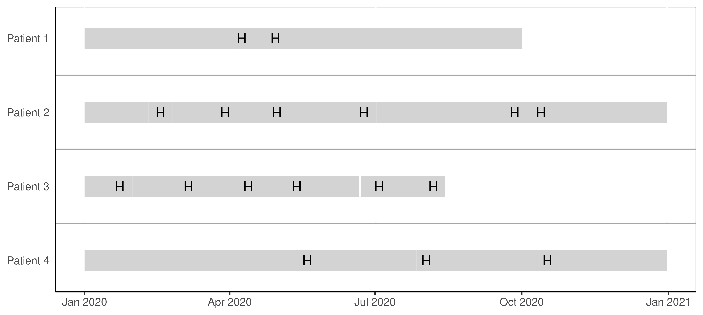


]

.panel[.panel-name[Forscher-Sicht]

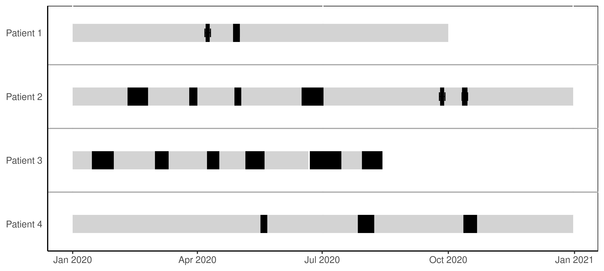

]

.panel[.panel-name[Neue Perspektive 1]

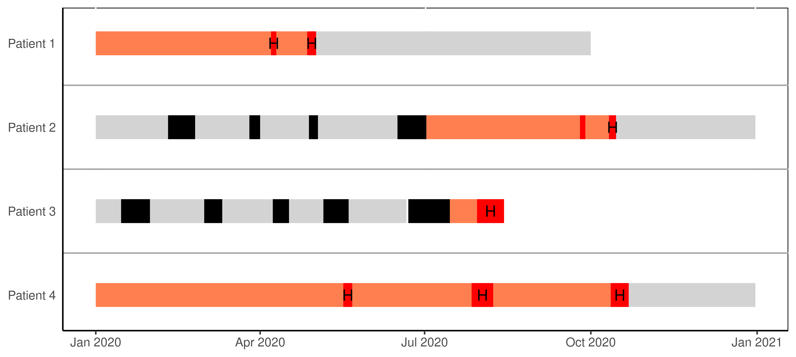

]

.panel[.panel-name[Neue Perspektive 2]


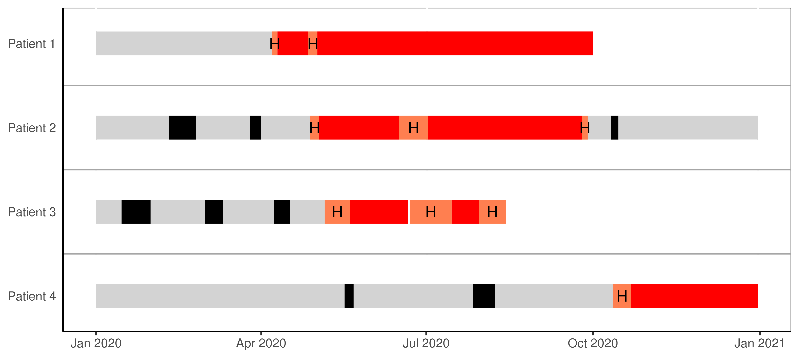

]

]


---
class: body-yellow
background-image: url(img/DrugSymposium_Background.png)

## 'Neu'-Land 1: stationäre <br /> Risikovorhersage mit <br /> digitalem Patientenkurven


---
# Was will man (stationär) vorhersagen?

```{r,echo=FALSE, eval=T, results='hide', message=F, warning=F }

# Library
library(ggplot2)
library(dplyr)
library(hrbrthemes)

# Create data
set.seed(1000)
data <- data.frame(
  x=LETTERS[1:26], 
  y=abs(rnorm(26))
)
 
# Reorder the data
data <- data %>%
  arrange(y) %>%
  mutate(x=factor(x,x))

Haerdtlein_data <- read.table("Haerdtlein/Score_Haerdtlein.csv", header=T, sep=";")
names(Haerdtlein_data)[1:2] <- c("ADE", "Score")
data <- Haerdtlein_data %>% filter(Situation == "inpatient") %>% select(ADE, Score) %>%
  dplyr::rename(x=ADE, y=Score) %>% 
  mutate(y=as.numeric(gsub(",", ".", as.character(y)))) %>%
  arrange(y) %>%
  mutate(x=factor(x,x))

  
# Plot
p <- ggplot(data, aes(x=x, y=y)) +
  geom_segment(aes(x=x, xend=x, y=0, yend=y), 
               color=ifelse(data$x %in% c("Acute kidney injury","Hypoglycaemia", "Hyperkalaemia", "Tachycardia ventricular","Fall (excl. fractures)"), "orange", "grey"), 
               size=ifelse(data$x %in% c("Acute kidney injury","Hypoglycaemia", "Hyperkalaemia", "Tachycardia ventricular","Fall (excl. fractures)"), 1.3, 0.7)) +
  geom_point(color=ifelse(data$x %in% c("Acute kidney injury","Hypoglycaemia", "Hyperkalaemia", "Tachycardia ventricular","Fall (excl. fractures)"), "orange", "grey"), 
             size=ifelse(data$x %in% c("Acute kidney injury","Hypoglycaemia", "Hyperkalaemia", "Tachycardia ventricular","Fall (excl. fractures)"), 5, 2)) +
  scale_x_discrete("Priorisierte \n unerwünschte Arzneimittelereignisse \n während des Krankenhausaufenthalts") +
  scale_y_continuous("Berechneter Score aus Ratings*", limits=c(2,5), breaks=c(2,3,4), labels=NULL) + 
  coord_flip() +
  theme_minimal() +
  theme(legend.position = "none",
        axis.line = element_line(size = 1, colour = "black", linetype = "solid"),
        axis.ticks.x = element_line(size = 0.8),
        axis.ticks.y = element_line(size = 0.8),
        axis.ticks.length = unit(.1, "cm"),
        axis.text.x = element_text(colour="black", size=10,angle=0, vjust=0.0, hjust=0.5),
        axis.text.y = element_text(colour="black", size=8, vjust=0.25),
        axis.title.y =  element_text(colour="black", size=12, face="bold"),#
        axis.title.x =  element_text(colour="black", size=12, face="bold"),#
        strip.text= element_text(colour="black", size=12),
        plot.title = element_text(hjust = 0.25, size=16),
        plot.title.position = "plot",
        panel.spacing = unit(2, "lines"),
        panel.grid.minor.x = element_blank(),
        plot.margin = unit(c(20,5,5,5), "pt")) # +
  #ggtitle("Priorisierte unerwünschte Arzneimittelereignisse", subtitle="während des Krankenhausaufenthalts")

# Add annotation
p <- p + annotate("text", x=grep("Acute kidney injury", data$x), y=data$y[which(data$x=="Acute kidney injury")]*1.2, 
           label="Denkbar in EHR", 
           color="orange", size=4 , angle=0, fontface="bold", hjust=0.75)  + 
    annotate("text", x = grep("Hypoglycaemia", data$x), y = data$y[which(data$x=="Hypoglycaemia")]*1.2, 
           label = "Gut denkbar in EHR" , 
           color="orange", size=4 , angle=0, fontface="bold", hjust=0.5) + 
    annotate("text", x = grep("Hyperkalaemia", data$x), y = data$y[which(data$x=="Hyperkalaemia")]*1.2, 
           label = "Gut denkbar in EHR" , 
           color="red", size=4 , angle=0, fontface="bold", hjust=0.5) + 
    annotate("text", x = grep("Tachycardia ventricular", data$x), y = data$y[which(data$x=="Tachycardia ventricular")]*1.2, 
           label = "Denkbar in EHR" , 
           color="orange", size=4 , angle=0, fontface="bold", hjust=0.5) + 
    annotate("text", x = grep("Fall (excl. fractures)", data$x), y = data$y[which(data$x=="Fall (excl. fractures)")]*1.2, 
           label = "?" , 
           color="orange", size=4 , angle=0, fontface="bold", hjust=0.5) 


```

```{r,echo=FALSE, eval=T, message=F, warning=F }

p

```

.footnote[[2] _modifiziert aus Haerdtlein A et al. J Clin Med 2022;11: Der relative Score berechnet sich aus dem Votum * Importance (1-4) durch die Gesamtanzahl der Panelmitglieder (damit stationär und ambulant vergleichbar sind) _ ] 


---

# **G**rammar of **p**rediction **models**

Risikovorhersage zu Zeiten $T_{1}$, $T_{2}$, $T_{n}$ nach stationärer Aufnahme (Zeitpunkt $T_{0}$)


.panelset[
.panel[.panel-name[Baseline-Prädiktor]
.pull-left[

]

.pull-right[

Beispiel: Trimester-Gewicht in den letzten 9 Monaten (Median aus Drei-Monats-Intervallen)

]

]

.panel[.panel-name[Rolling-Prädiktor]


.pull-left[
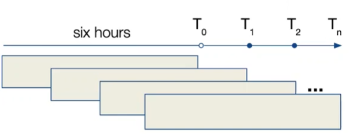
]

.pull-right[

Beispiel: Zeitabhängige Definition von *minimalem*, *maximalem* und *letztem* Messwert zum systolischen Blutdruck über die letzten sechs Stunden

]

]

.panel[.panel-name[Growing-Prädiktor]

.pull-left[
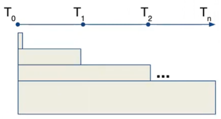
]

.pull-right[

Beispiel: Kumulativer Blutverlust seit Aufnahme

]

]

.panel[.panel-name[Zfsg]


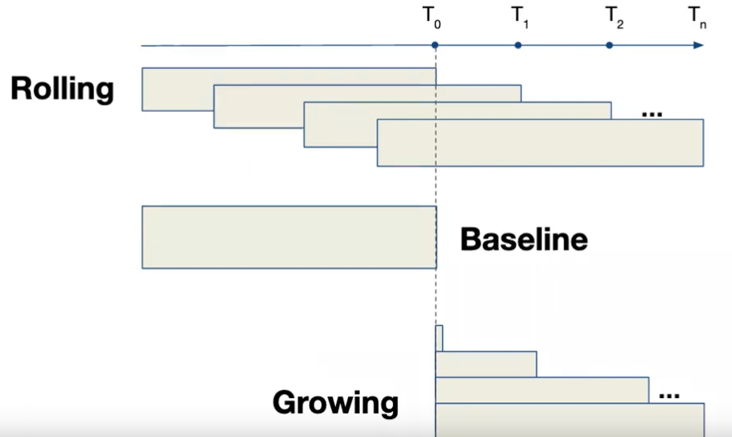
<!--.footnote[
_gp: the grammar of prediction models_
]-->


]

]


---
exclude:true
# EHR-Beispieldaten

```{r,echo=FALSE,fig.width=7,fig.height=5, eval=T}
load("gp_example_df.RData")

```


.panelset[
.panel[.panel-name[Zeit-konstant]

```{r,echo=FALSE, eval=T}
head(sample_fixed_data)

```

]

.panel[.panel-name[Zeit-variabel]

```{r,echo=FALSE, eval=T}
head(sample_temporal_data)

```

]

.panel[.panel-name[Umfang]

```{r,echo=FALSE, eval=T}
names(tf)

```

]

.panel[.panel-name[Analysis set]

```{r,echo=FALSE, eval=T}
head(model_data[,c("id", "time", "sex", "age", "baseline_cr", "growing_cr_max", "cr_max_06", "outcome_cr_max_24")])

```

]

]


---
exclude:true
# Voraussetzungen

> Longitudinale Daten: Wiederholte Messungen bei Patienten 

> Verfahren müssen mit folgendem umgehen können:

- fehlende Werte &#9989; <br> <br>

- verschiedene Kovarianz-Strukturen (u.a. auto-regressive Abhängigkeiten) &#9989; <br> <br>

- nicht-lineare Zusammenhänge? <br> <br>


---
exclude:true

# Zurück zu (Beispiel-) EHR


.panelset[

.panel[.panel-name[lme]

```{r,lme, eval=TRUE, echo=TRUE}
lmer_mod <- lmer(outcome_cr_max_24 ~ time + age + baseline_cr + 
                      growing_cr_max + cr_max_12 + sex +  med_aspirin_sum_168 + 
                      med_acetaminophen_sum_168 + med_diphenhydramine_sum_168 + (1 + time | id),
                    data = model_data)

```
mit: <br>
`outcome_cr_max_24`= max. Crea in nächsten 24h (Outcome)  <br>
`baseline_cr`= Ausgangswert (*baseline*) <br>
`growing_cr_max`=  cumulative max creatinine since admission (*growing*) <br>
`cr_max_12`= max. Crea in letzten 12h (*rolling*) <br>
`med_[x]`= kumulierte Verordnungen (*growing*)

]

.panel[.panel-name[gam]

Dem *lme* äquivalentes GAM-Modell:

```{r,gam-me, eval=TRUE, echo=TRUE}
gam_mod <- gamm4(outcome_cr_max_24~time + age + baseline_cr + 
                      growing_cr_max + cr_max_12 + sex + med_aspirin_sum_168 + 
                      med_acetaminophen_sum_168 + med_diphenhydramine_sum_168, family=gaussian,
           data=model_data, random = ~ (1+time|id))

```

]

.panel[.panel-name[lme summary]

```{r,lme-summary, eval=TRUE, echo=FALSE}
options(scipen = 999999)
summary(lmer_mod)$coefficients 

```

]

.panel[.panel-name[gam summary]

```{r,gam-summary, eval=TRUE, echo=FALSE}

df<-data.frame(Estimate=summary(gam_mod$gam)$p.coeff, Std_Error=summary(gam_mod$gam)$se[1:length(summary(gam_mod$gam)$p.coeff)], t_value=summary(gam_mod$gam)$p.t, p_value=round(summary(gam_mod$gam)$p.pv, 5))
rownames(df) <- names(summary(gam_mod$gam)$p.coeff)
print(df)

#summary(gam_mod$gam)$coefficients 

```

]


.panel[.panel-name[splines]

```{r,gam-me-splines, eval=TRUE, echo=TRUE}
gam_mod_spline <- gamm4(outcome_cr_max_24~time + age + baseline_cr + 
                      s(growing_cr_max) + s(cr_max_12) + sex + med_aspirin_sum_168 + 
                      med_acetaminophen_sum_168 + med_diphenhydramine_sum_168, family=gaussian,
           data=model_data, random = ~ (1+time|id))


```

Spline effects:
```{r,gam-summary-splines, eval=TRUE, echo=FALSE}
print(round(summary(gam_mod_spline$gam)$s.table, 5))
```

]

<!--.panel[.panel-name[spline summary]

Fixed effects:

```{r,gam-summary-spline, eval=TRUE, echo=FALSE}

df<- data.frame(Estimate=summary(gam_mod_spline$gam)$p.coeff, Std_Error=summary(gam_mod_spline$gam)$se[1:length(summary(gam_mod_spline$gam)$p.coeff)], t_value=summary(gam_mod_spline$gam)$p.t, p_value=round(summary(gam_mod_spline$gam)$p.pv,5))
rownames(df) <- names(summary(gam_mod_spline$gam)$p.coeff)
print(df)

#summary(gam_mod$gam)$coefficients 

```

Spline effects:
```{r,gam-summary-s, eval=TRUE, echo=FALSE}
print(round(summary(gam_mod_spline$gam)$s.table, 5))
```


```{r,gam-me-splineplot, eval=F, echo=F}

gam_predict <- expand_grid(age = seq(30,90,10),
                               time = seq(0, 120, by = 12),
                               id=rep(1:10),
                               baseline_cr=mean(model_data$baseline_cr),
                               growing_cr_max=0.8,
                               sex="male", race="black", med_aspirin_sum_168=0,
                               med_acetaminophen_sum_168=0, med_diphenhydramine_sum_168=0,
                               cr_max_12=seq(0.3,1.5,0.1))
gam_predict<-gam_predict%>%
  mutate(fit = predict(gam_mod_spline$gam,gam_predict,se.fit = TRUE,type='response')$fit,
         se.fit = predict(gam_mod_spline$gam, gam_predict,se.fit = TRUE,type='response')$se.fit)

model_data %>% filter(time <=150) %>% 
  ggplot(data=., aes(x=growing_cr_max, y=outcome_cr_max_24, group=factor(time), colour=factor(time))) + #
  geom_point(size=1.5,alpha=0.5,show.legend = FALSE)+ #geom_line(aes(x=growing_cr_max, y=outcome_cr_max_24)) + 
  geom_smooth(se=F)

```

]-->


]

---
# Die digitale Kurve am UKHD

.panelset[
.panel[.panel-name[Medikation]


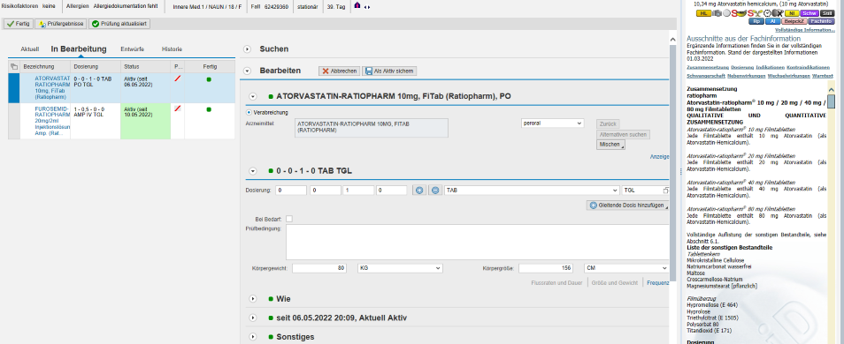


]

.panel[.panel-name[Nutzeransicht]


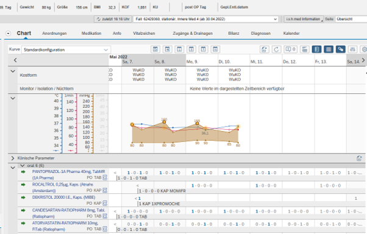


]

.panel[.panel-name[Datenbank]


]

.panel[.panel-name[Datenumfang]


.footnote[[3] _Scherkl et al., unpublished data_ ] 


]

]

---
# Prescribing Monitoring

<!-- 
 <br /> 
-->

> '*Modellbasierte Entscheidungsunterstützung durch Nutzung einer digitalen Kurve, wobei arzneimittel-assoziierte Risiken beim Verschreibungsprozess berücksichtigt, währenddessen überwacht und gegebenenfalls bewarnt werden*'

--

> Die Situationen können sich auf das 
+ Risiko eines unerwünschten Ereignisses, 
+ eines Biomarkers oder 
+ einer Arzneimittelexposition 

> beziehen. 

--

> Risiken oder künftige Beobachtungen für diese Situationen müssen 
+ individuell unter Berücksichtigung bestimmter Patientenmerkmale vorhergesagt werden, 
+ longitudinal über einen künftigen Zeitraum vorhergesagt werden und 
+ dynamisch vorhergesagt werden.


.footnote[[4] _Scherkl et al., unpublished data_ ] 

---
# Pilotanalyse


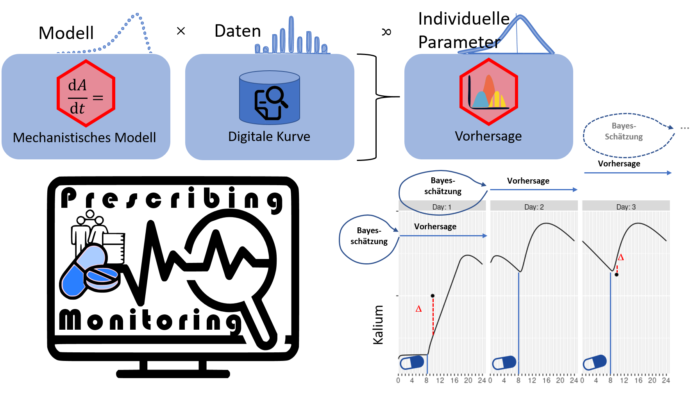
.footnote[[5] _Meid et al., unpublished data_ ] 


---
class: body-yellow
background-image: url(img/DrugSymposium_Background.png)

## 'Neu'-Land 2: ambulante <br /> Risikomodelle (inkl. <br /> digitale Patientenakten)


---
# Risiken im ambulanten Bereich


```{r,echo=FALSE, eval=T, results='hide', message=F, warning=F, out.height="100%" }

Haerdtlein_data <- read.table("Haerdtlein/Score_Haerdtlein.csv", header=T, sep=";")
names(Haerdtlein_data)[1:2] <- c("ADE", "Score")
data <- Haerdtlein_data %>% filter(Situation == "outpatient") %>% select(ADE, Score) %>%
  dplyr::rename(x=ADE, y=Score) %>% 
  mutate(y=as.numeric(gsub(",", ".", as.character(y)))) %>%
  arrange(y) %>%
  mutate(x=factor(x,x))

  
# Plot
p <- ggplot(data, aes(x=x, y=y)) +
  geom_segment(aes(x=x, xend=x, y=0, yend=y), 
               color=ifelse(data$x %in% c("Acute kidney injury", "Hyperkalaemia", "Tachycardia ventricular","Fall (injuries)"), "orange", "grey"), 
               size=ifelse(data$x %in% c("Acute kidney injury", "Hyperkalaemia", "Tachycardia ventricular","Fall (injuries)"), 1.3, 0.7)) +
  geom_point(color=ifelse(data$x %in% c("Acute kidney injury","Hyperkalaemia", "Tachycardia ventricular","Fall (injuries)"), "orange", "grey"), 
             size=ifelse(data$x %in% c("Acute kidney injury", "Hyperkalaemia", "Tachycardia ventricular","Fall (injuries)"), 5, 2)) +
  scale_x_discrete("Priorisierte \n unerwünschte Arzneimittelereignisse \n bei Aufnahme (Entstehung ambulant)") +
  scale_y_continuous("Berechneter Score aus Ratings*", limits=c(2,5), breaks=c(2,3,4), labels=NULL) + 
  coord_flip() +
  theme_minimal() +
  theme(legend.position = "none",
        axis.line = element_line(size = 1, colour = "black", linetype = "solid"),
        axis.ticks.x = element_line(size = 0.8),
        axis.ticks.y = element_line(size = 0.8),
        axis.ticks.length = unit(.1, "cm"),
        axis.text.x = element_text(colour="black", size=10,angle=0, vjust=0.0, hjust=0.5),
        axis.text.y = element_text(colour="black", size=8, vjust=0.25),
        axis.title.y =  element_text(colour="black", size=12, face="bold"),#
        axis.title.x =  element_text(colour="black", size=12, face="bold"),#
        strip.text= element_text(colour="black", size=12),
        plot.title = element_text(hjust = 0.25, size=16),
        plot.title.position = "plot",
        panel.spacing = unit(2, "lines"),
        panel.grid.minor.x = element_blank(),
        plot.margin = unit(c(20,5,5,5), "pt"))  #+
  #ggtitle("Priorisierte unerwünschte Arzneimittelereignisse", subtitle="bei Krankenhausaufnahme (Entstehung ambulant)")

# Add annotation
p <- p + annotate("text", x=grep("Acute kidney injury", data$x), y=data$y[which(data$x=="Acute kidney injury")]*1.2, 
           label="Kaum sinnvoll", 
           color="orange", size=4 , angle=0, fontface="bold", hjust=0.75)   + 
    annotate("text", x = grep("Hyperkalaemia", data$x), y = data$y[which(data$x=="Hyperkalaemia")]*1.2, 
           label = "Limitiert in claims" , 
           color="red", size=4 , angle=0, fontface="bold", hjust=0.5) + 
    annotate("text", x = grep("Tachycardia ventricular", data$x), y = data$y[which(data$x=="Tachycardia ventricular")]*1.2, 
           label = "Limitiert in claims" , 
           color="orange", size=4 , angle=0, fontface="bold", hjust=0.65) + 
    annotate("text", x = grep("Fall (injuries)", data$x), y = data$y[which(data$x=="Fall (injuries)")]*1.2, 
           label = "Denkbar in claims" , 
           color="orange", size=4 , angle=0, fontface="bold", hjust=0.75) 


p

```

.footnote[[6] _modifiziert aus Haerdtlein A et al. J Clin Med 2022;11: Der relative Score berechnet sich aus dem Votum * Importance (1-4) durch die Gesamtanzahl der Panelmitglieder (damit stationär und ambulant vergleichbar sind) _ ] 


---
# Ein Pilot-Projekt als Blaupause?


 <br /> 
.footnote[[7] _https://www.dundee.ac.uk/hic/safe-haven_ <br /> [8] _Scherkl et al., unpublished data._ ] 


---
class: body-yellow
background-image: url(img/DrugSymposium_Background.png)

## Fallstricke


---
# 7 Herausforderungen für Prädiktionsmodelle aus Routinedaten


.pull-left[

    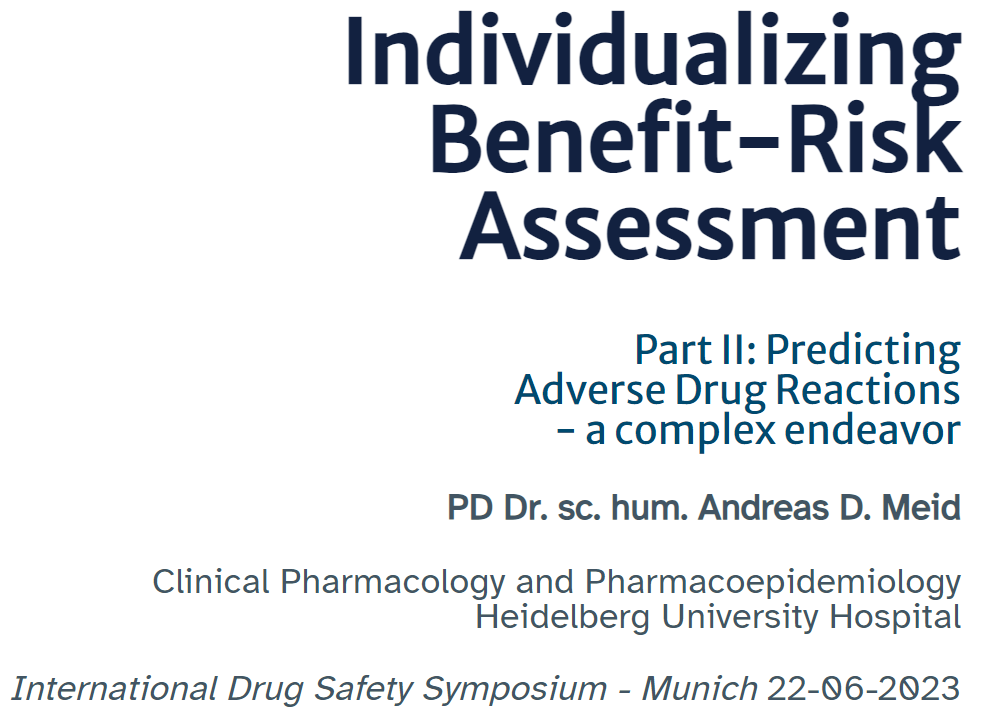
    
  ]
  
.pull-right[

  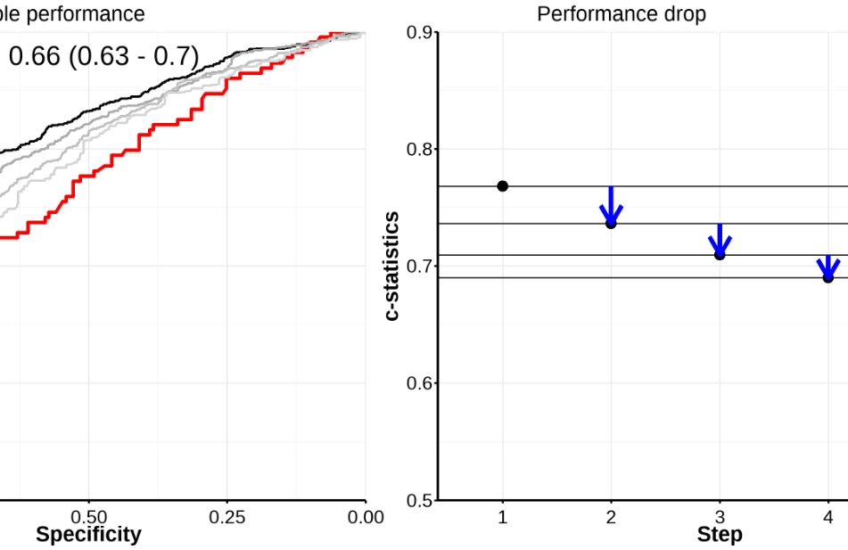
    
  ]


.footnote[[9] _https://andreasmeid.github.io/ADR_Prediction/, aufgerufen am 28.9.2023_ ] 


---

# *Dataset shift* ist ein ernstes Problem


.footnote[[10] _Finlayson SG et al. N Engl J Med 2021;385:283-286._]


---
exclude:true
# Mittelfristige Fragestellungen in Pilot-Daten (und Echt-Zeit-Daten?)

- Wie erkennt man durch (dynamische / longitudinale) EHR-Daten medikations-assoziierte Risiken für/mit bspw.

 - (Laborwert-) Surrogate: Kreatinine, Kalium, ...
 
 - Mortalität (während Aufenthalt und/oder danach) oder
 
 - eine längere Verweildauer oder
 
 - Nierenversagen oder
 
 - Rehospitalisierungen oder
 
 - Verlegung auf Intensivstation?


---
# Danke an ...


```{css, echo=FALSE}
.link-style1 a {
  color: blue;
  text-decoration: underline;
}

.link-style2 a {
 color: blue;
}

```

<!-- 
E-mail: .link-style1[[example@gmail.com](mailto:example@gmail.com)]
Also visit this page .link-style2[[wikipedia](https://en.wikipedia.org/wiki/Main_Page)]

-->

.pull-left[

.pull-left-wide[
+ Bereich *Pharmakoepidemiologie* am UKHD


|            | Weitere Schwerpunkte     | 
|------------------|------------------|
| .link-style2[[Andreas Meid](https://andreas-d-meid.netlify.app/)]    | Pharmakometrie, Biometrie |
| Camilo Scherkl     | EHR-Daten, CDSS  | 
| Ignacio Leiva-Escobar | RCT-Daten, *Data Science* |
    
+ Expertengruppe *Prescribing Monitoring*, hier zusätzlich

  + Hanna Seidling
  + David Czock
  + Michael Metzner 

  ]
  ]
  
.pull-right[

+ Prof. Dr. Tobias Dreischulte und Arbeitsgruppe, *LMU Institut für Allgemeinmedizin*

+ *health informatics centre (hic)*, University of Dundee

******


+ Abteilung .link-style2[[*Klinische Pharmakologie und Pharmakoepidemiologie*](https://www.klinikum.uni-heidelberg.de/kliniken-institute/kliniken/zentrum-fuer-innere-medizin-krehl-klinik/abt-klinische-pharmakologie-und-pharmakoepidemiologie)] 

+ *Zentrum für Digitalisierung und Informationstechnologie* (ZDI)

+ ...

<!-- 
.center[]
-->

   
]


---
class: body-yellow
background-image: url(img/background06.png)

## AusblicK & <br /> Diskussion 

